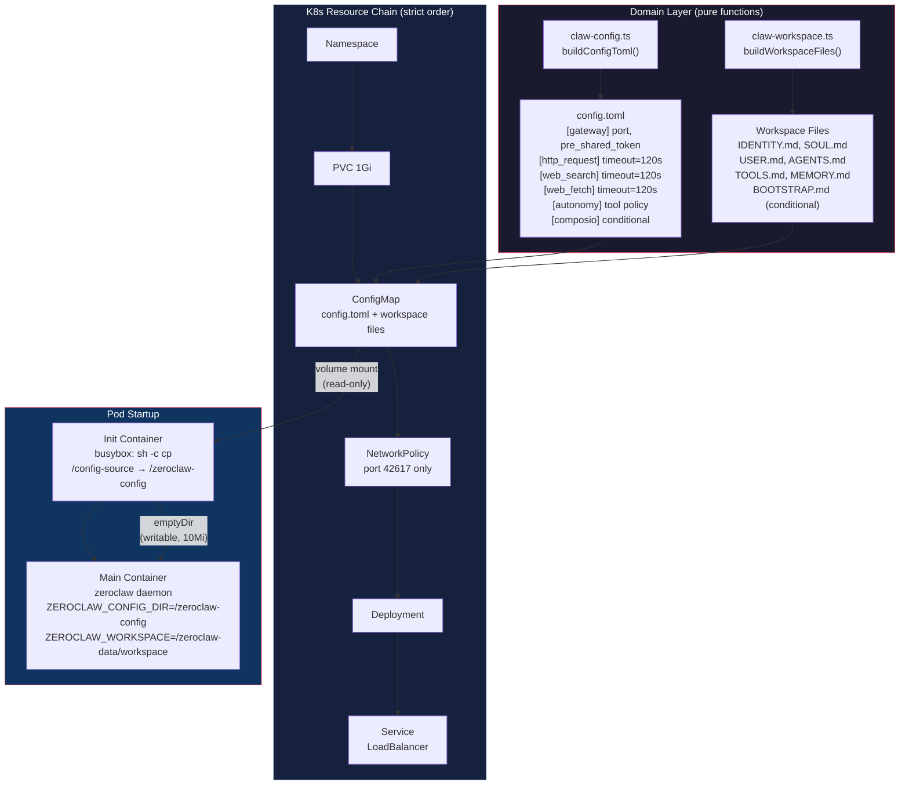
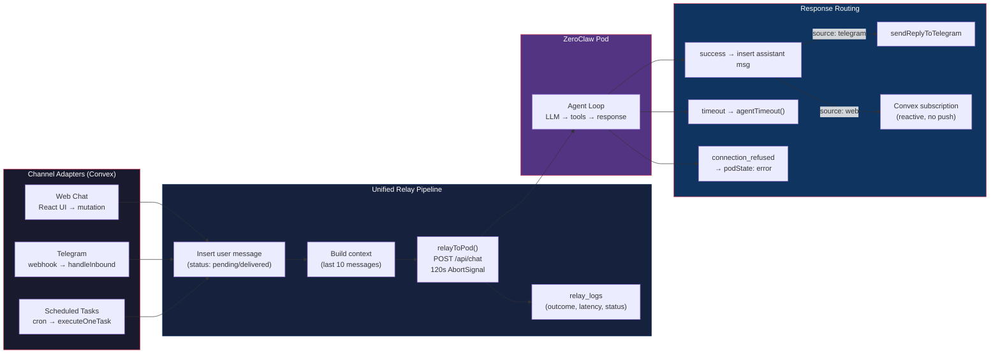
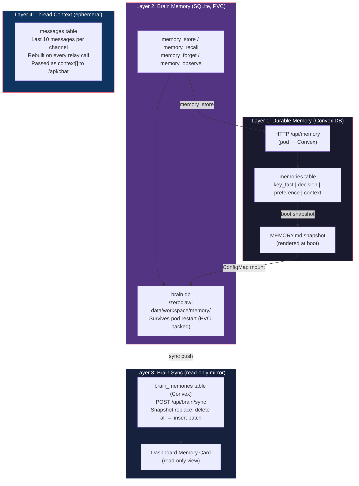
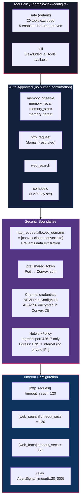
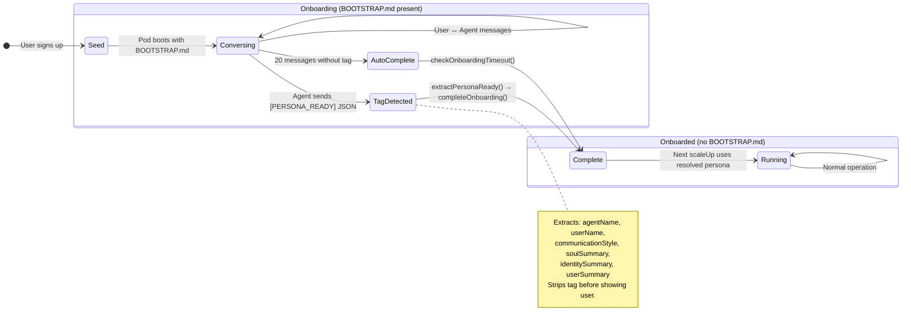
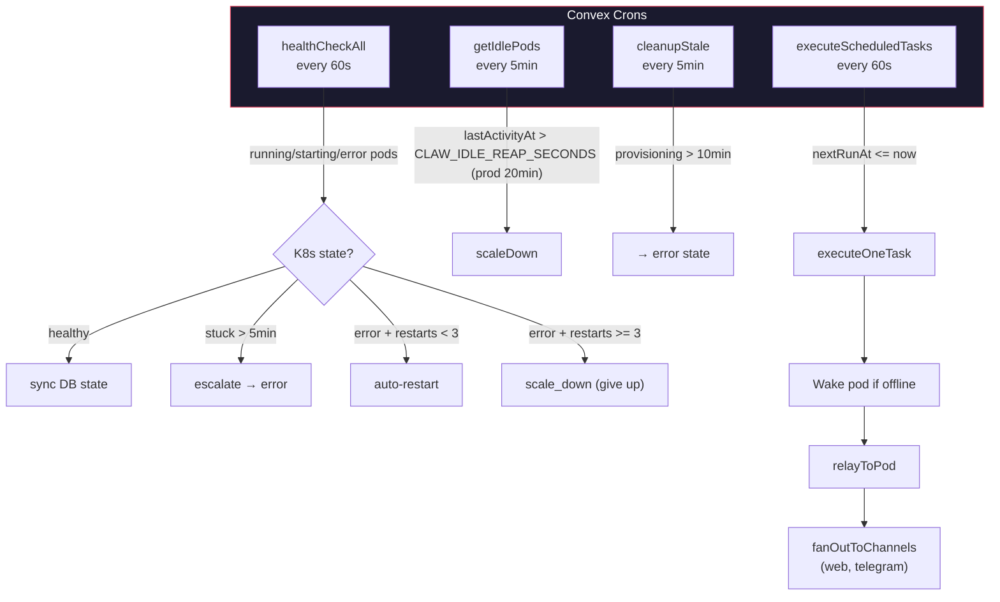
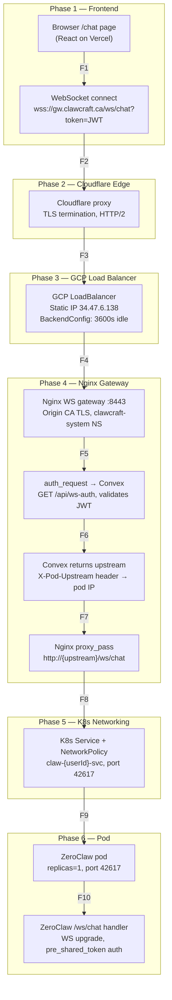

# Claw System State Machine

## 1. Pod Lifecycle & Scaling

```mermaid
stateDiagram-v2
    direction LR

    [*] --> pending: signup / Google OAuth

    state "Control Plane (Convex)" as cp {
        pending --> provisioning: provisionUser()
        provisioning --> starting: K8s resources created
        starting --> running: /health 200 OK
        running --> scaled_down: idle > CLAW_IDLE_REAP_SECONDS (reapIdlePods cron; prod 20min)
        scaled_down --> starting: inbound wakes (ws-auth / web / email / Telegram → scaleUp)
        starting --> error: stuck > 5min
        running --> error: connection_refused
        provisioning --> error: GKE API failure
        error --> starting: healthCheckAll (restartCount < 3)
        error --> scaled_down: restartCount >= 3 (give up)
    }

    note right of running
        Pod is live. Relay active.
        Config: /zeroclaw-config/config.toml
        Workspace: /zeroclaw-data/workspace/
        Brain: /zeroclaw-data/workspace/memory/brain.db
    end note

    note right of scaled_down
        Replicas = 0. PVC retained.
        brain.db survives restart.
        Next scaleUp rebuilds ConfigMap
        from fresh DB state.
    end note
```



## 2. Configuration Pipeline



## 3. Message Routing (Unified Relay)



The diagram above shows the web/Telegram/scheduled paths that relay via `POST /api/chat` (`{ message }`, gateway format). **Email and Linq differ on both ends** and are not yet in the diagram:

- **Inbound** — Email (CF → Convex `/email-webhook`) and Linq (Linq → Convex `/linq-webhook`) insert the user message Convex-side, then relay through the **gateway `/relay/{userId}` → pod:42618 channel webhook** (`{ sender, content }` format, `[EMAIL_RECEIVED]`/`[LINQ_RECEIVED]` envelope), NOT `/api/chat`. Inbound is **durable**: the row persists even when the pod is `scaled_down`/`error`, and `deliverQueued` relays on the next healthy tick.

### 3.6 Asymmetric outbound topology (Linq — as-built)

Linq is the **first channel whose outbound delivery is not symmetric** with the relay pipeline above. As-built (claw-doctrine §3.5, backend-doctrine §8.2):

- The pod posts its reply to the generic `/container-webhook` (webhook-channel `send_url`).
- `linq.tryRouteAssistantReply` (Convex) heuristically detects a Linq-context reply (user's most-recent thread) and calls `linqRelay.sendOutbound` → Linq Partner V3, **before** the generic `source: "webhook"` branch — then persists the assistant row with `source: "linq"`.

This is a **stopgap**: the pod-native `LinqChannel::send` path (preferred) was never merged. Known race: concurrent senders to one number can misroute via the most-recent-thread heuristic. Future Convex-mediated channels (slack/whatsapp/discord) MUST NOT silently retrofit this asymmetry — keep it documented; landing the sovereign-fork supersedes the stopgap (guard against double-sends with a feature flag).

## 4. Memory Architecture (4 Layers)



## 5. Tool Call & Security Boundaries



**Two distinct outbound classes — do not conflate.** `http_request.allowed_domains` (above) bounds **agent-driven tool calls** (`http_request`/`web_fetch`), restricting the LLM to `convex.cloud`/`convex.site` to prevent data exfiltration. It does **not** bound **channel-adapter outbound** — the pod (or Convex, for the Linq stopgap) calling a partner API to deliver a reply. Channel-adapter outbound (Telegram → `api.telegram.org`, Composio, the Linq Partner V3 send) is bounded only by **Kubernetes NetworkPolicy egress**, never by `allowed_domains`. A future channel's outbound endpoint does not belong in `allowed_domains`.

## 6. Onboarding State Machine



## 7. Cron Jobs & Scheduled Operations



## 8. Praxis-Owned State Machines (pointers)

Praxis owns two state machines that the claw control plane consumes via Convex projection: spec lifecycle (§8.1 — binary `active | inactive`) and per-execution lifecycle (§8.2 — ternary `in_flight | completed | abandoned`). Both have canonical definitions in [`praxis-doctrine.md`](praxis-doctrine.md); this section captures the operator-facing intersections.

### 8.1 Spec Lifecycle

The spec state machine is binary: `active | inactive`. Canonical definition + state diagram + invariants live in [`praxis-doctrine.md`](praxis-doctrine.md) §9.4 (derivation) and §9.8 (trigger model). This section is a pointer, not the source of truth.

Key invariants for claw operators (the parts that intersect this doctrine's domain):
- **Validation wakeup posture (Spec 4b).** On a cache hit, the `internal.specValidation.runValidation` V8 mutation persists `spec_validations` transactionally with `stagesRun: { structure: false, tools: false, semantic: true }` + `semanticSkipReason: "cache_hit"` — no pod traffic, no wake, ~50ms. On a cache miss, `internal.webhookDispatch.sendValidationWebhook` POSTs a `[system]`-prefixed message to the pod's `/webhook` endpoint (the same channel email-relay already uses). Wakeup-on-validate is therefore consistent with wakeup-on-message — Spec 4b softened the pre-4b "validation never wakes" promise to: cache hits stay wake-zero; cache misses use the existing `/webhook` channel and inherit its wakeup policy. If the pod is unreachable, `sendValidationWebhook` returns `{ outcome: "skipped", reason: "pod_unavailable" }` and no row lands; the user clicks Validate again once the pod is back.
- **Spec activation flips on validation completion.** `specs.active?: boolean` is the materialized snapshot of `deriveSpecState({ openPriorWorkBeads, liveBlockingFindings })`. The cache-hit branch of `runValidation` flips it locally; the projection-side `reconcileValidations` (Spec 4b §3.6) flips it after pod-side `praxis spec verify --persist` lands findings. The agent runtime filters discoverable specs by `active: true`, so a spec gaining a blocking finding is effectively retired from the agent's view without a config change.

For the full state diagram, triggers, and invocation sites see `praxis-doctrine.md` §9.

### 8.2 Execution Lifecycle (per-execution; praxis-owned)

The execution state machine is ternary: `in_flight | completed | abandoned` (praxis-hardening 0.11.0, decision D6 — `abandoned` is the honest terminal for a run that cannot finish, set by `praxis verify --execution <id> --abandon --reason <why>`; it was binary `in_flight | completed` pre-0.11.0). Canonical definition + on-disk shape + mutex discipline live in [`praxis-doctrine.md`](praxis-doctrine.md) §10.3–§10.6. The Convex projection materializes each execution row via `apps/clawcraft/convex/praxisLink.ts:reconcileExecutions` (idempotent upsert keyed by `praxisExecutionId`).

Key invariants for claw operators (parts that intersect this doctrine's domain):
- **Execution-start wakeup posture (Spec 4b).** `requestStart` calls `internal.webhookDispatch.sendExecutionWebhook`, which POSTs a `[system]`-prefixed `/webhook` message instructing the pod's agent to run `praxis spec activate-execution`. Mirrors the §8.1 validation rule post-4b: wakeup-on-execute is consistent with wakeup-on-message (the `/webhook` channel is shared with email-relay). On dispatch failure (pod unreachable, non-2xx, timeout), the action returns `{ outcome: { status: "skipped", reason } }` with NO `executions` row persisted. On dispatch success the action returns `{ outcome: { status: "queued" } }` with NO eager row insert — the praxis daemon's projection emitter lands the row lazily via `reconcileExecutions` on its first git push. The pre-4b dedicated `POST /api/execute/start` Rust handler was never built; the entire dedicated-endpoint track is retired (see `claw-doctrine.md` §5.1 v2.31.0).
- **No `failed` literal in the execution status enum.** Failures during execution route through `waiting_for` beads with `assignee: "user"` (praxis-doctrine §10.9), or — when the walk cannot make progress at all — through the explicit `abandoned` terminal (D6). There is no implicit failure state.
- **Parked is a derived predicate, not a status (D1).** A parked run keeps `status: in_flight` and carries a derived/snapshot discriminator `parked: ParkedSnapshot | null`; `execute` writes the snapshot at the park transition and clears it at unpark, and is the only writer of that field. Parked is never a canonical state literal — there is no `parked` status enum value and no separate unparking writer.
- **A long-lived `in_flight` row splits into two distinct cases — do not conflate them.** (a) **Parked** = healthy: the walk is waiting at a human/timer/event boundary (`parked != null`), and is resumable. (b) **Wedged** = genuinely stuck: no ready bead, nothing parked or `needs_user`, and not all beads resolved. A parked run needs no intervention; a wedged run's honest exit is `praxis verify --execution <id> --abandon` (D6). The pre-0.11.0 "an `in_flight` row indefinitely is a stalled execution awaiting user intervention" sentence conflated these and is superseded.
- **Derived-parked preserves the in-flight mutex for free (D11).** Because a parked run keeps `in_flight`, every existing in-flight gate (`by_user_active`, the single-active-run slot) stays correct with no change: a parked run still occupies the one in-flight slot — resume, don't fork. Only `completed` and `abandoned` release the slot. No new status literal means no projection or gate code to touch — `reconcileExecutions` materializes the same three terminal-or-not rows.
- **Resume-wakeup posture (user mandate — §7 cron catalog deliberately unchanged).** A parked run on a `scaled_down` pod resumes on the pod's *next wake* — there is NO timer-driven pod `scaleUp` and NO new Convex cron for parked-run wakeup. The correctness mechanism is the AGENTS.md `praxis execute --list` due-scan run on every pod activation; the agent-armed zeroclaw pod cron firing on wake is an optimization, not the timer host. The §7 Convex-cron catalog (`healthCheckAll`, `getIdlePods`, `cleanupStale`, `executeScheduledTasks`) is intentionally NOT extended by praxis-hardening — parked-run timing is owned by the pod, not the system cron.
- **Vocabulary disambiguation — "parked".** In this doctrine "parked" means the execution-lifecycle `ParkedSnapshot` discriminator above. The frontend's `parked` UI discriminator (the operator surface for that same snapshot) and the `parked` dev-tooling concept are downstream of this single source of truth, not separate state-machine states — none of them introduce a new status literal.

## 9. Linq Number Lifecycle (add-linq)

A `linq_numbers` row carries **two independent state machines** (methodology §1 — `status` is ours, `linqStatus` is the partner's; never overload one name):

**Our provisioning workflow** (`linq_numbers.status`):

```
pending ──(operator: rep returns number)──▶ registering ──(advanceStatus + phoneNumber)──▶ active
                                                                                              │
                                                            (disconnect: tombstone row, restartPodForIntegration)
```

- Number provisioning is **manual** (operator emails a Linq rep; no self-serve API). `advanceStatus` is an internal mutation; infra-doctrine §17 is the operator runbook.
- **`[channels_config.linq]` renders ONLY at `active`** (claw-doctrine §17.3). The `→ active` transition regenerates the ConfigMap and restarts the pod (`restartPodForIntegration`).

**Upstream partner health** (`linq_numbers.linqStatus` / `linqHealth`, patched by `phone_number.status_updated` webhook events): `ACTIVE` / `FLAGGED` / `AT_RISK` / `CRITICAL`. Transitions to `FLAGGED` or degraded health fire `OPS_ALERT_WEBHOOK_URL`.

**Impact-analysis invariant — Linq inbound does NOT drive pod lifecycle.** Unlike a chat message (which can wake a `scaled_down` pod via `scaleUp`), Linq inbound durability lives in the `messages` row written at Convex-receive time, NOT in the partner's retry window. A `phone_number.status_updated` event updates the health fields but **does NOT gate ConfigMap rendering** — flagging is informational; only the provisioning `status` reaching `active` (or disconnect) changes the pod's config. This keeps partner-health churn from triggering pod restarts.

---

# WebSocket Chat Critical Path — Root Cause Analysis

## Critical Path: `/chat` → Pod `/ws/chat`

Every WebSocket message from the browser traverses 10 failure points across 7 phases before reaching the ZeroClaw pod. This document maps each failure point, its symptoms, root cause candidates, and the exact commands to get observability data.

---

## 1. Process Diagram



---

## 2. Failure Point Reference

| ID | Failure Point | Phase | Symptom | Root Cause Candidates | Diagnostic Command |
|----|--------------|-------|---------|----------------------|-------------------|
| **F1** | Browser fails to load `/chat` | Frontend | Blank page, JS errors | Vercel deploy broken, CDN outage, OAuth token expired | `curl -I https://soulboundlabs.com/chat` + Browser DevTools → Console + Network tab |
| **F2** | WS connection rejected at DNS/TLS | Frontend | `ERR_NAME_NOT_RESOLVED`, TLS handshake failure | DNS misconfigured, Cloudflare orange-cloud off, cert expired | `dig gw.clawcraft.ca +short` |
| | | | | | `openssl s_client -connect gw.clawcraft.ca:443 -servername gw.clawcraft.ca 2>/dev/null \| openssl x509 -noout -dates` |
| **F3** | Cloudflare → GCP origin fails | Cloudflare | 522/523/524 Cloudflare errors | Origin IP unreachable, Cloudflare timeout, Origin CA expired, Full Strict mode mismatch | Cloudflare dashboard → Analytics → Edge errors |
| | | | | | `curl -v --resolve gw.clawcraft.ca:443:34.47.6.138 https://gw.clawcraft.ca/health` |
| **F4** | GCP LB drops WS connection | GCP LB | WS closes after ~30s | BackendConfig missing or `timeoutSec < 3600`, backend health check failing | `kubectl get backendconfig -n clawcraft-system -o yaml` |
| | | | | | `gcloud compute backend-services describe <name> --global --format='value(timeoutSec)'` |
| **F5** | Nginx pod down or misconfigured | Nginx | 502/504 from gateway | Nginx pod crash, config syntax error, OOM kill | `kubectl get pods -n clawcraft-system -l app=ws-gateway` |
| | | | | | `kubectl logs -n clawcraft-system deploy/ws-gateway --tail=100` |
| | | | | | `kubectl exec -n clawcraft-system deploy/ws-gateway -- nginx -t` |
| **F6** | auth_request to Convex fails | Nginx/Convex | 401 or 500 on WS upgrade | JWT expired/malformed, Convex function error, Convex outage, pod in `scaled_down` state | `kubectl logs -n clawcraft-system deploy/ws-gateway --tail=50 \| grep auth` |
| | | | | | Convex dashboard → Logs → filter `ws-auth` |
| | | | | | `curl -H "Authorization: Bearer <JWT>" https://<convex-url>/api/ws-auth` |
| **F7** | Convex returns wrong/stale upstream | Convex | WS connects but messages go nowhere | Pod IP changed after restart, stale `endpoint` in Convex DB, pod in `not_found` state | Convex dashboard → Data → users table → check `podEndpoint` |
| | | | | | `kubectl get svc -n claw-{userId} -o wide` |
| **F8** | Nginx can't reach pod ClusterIP | Nginx→K8s | 502 from Nginx | Pod not running, Service has no endpoints, cross-namespace DNS failure | `kubectl get endpoints -n claw-{userId} claw-{userId}-svc` |
| | | | | | `kubectl exec -n clawcraft-system deploy/ws-gateway -- wget -qO- http://claw-{userId}-svc.claw-{userId}.svc.cluster.local:42617/health` |
| **F9** | NetworkPolicy blocks traffic | K8s | Connection timeout from gateway to pod | NetworkPolicy missing `clawcraft-system` ingress rule, label mismatch on namespace | `kubectl get networkpolicy -n claw-{userId} -o yaml` |
| | | | | | `kubectl describe netpol claw-{userId}-netpol -n claw-{userId}` |
| **F10** | Pod running but ZeroClaw unhealthy | Pod | WS upgrade fails with 503 or connection reset | CrashLoopBackOff, config.toml parse error, OOM, port 42617 not listening | `kubectl get pods -n claw-{userId}` |
| | | | | | `kubectl logs -n claw-{userId} deploy/claw-{userId} --tail=100` |
| | | | | | `kubectl exec -n claw-{userId} deploy/claw-{userId} -- curl -s localhost:42617/health` |

---

## 3. Quick Triage Sequences

### WS never connects (no upgrade)

Start at F2, work down:

```bash
# 1. DNS resolves?
dig gw.clawcraft.ca +short

# 2. TLS valid?
openssl s_client -connect gw.clawcraft.ca:443 -servername gw.clawcraft.ca 2>/dev/null | openssl x509 -noout -dates

# 3. Nginx gateway pod alive?
kubectl get pods -n clawcraft-system -l app=ws-gateway

# 4. Convex ws-auth responding?
# Check Convex dashboard → Logs → filter "ws-auth"
```

### WS connects then immediately drops

Likely F4 (idle timeout) or F10 (pod crash):

```bash
# 1. BackendConfig idle timeout set?
kubectl get backendconfig -n clawcraft-system -o yaml | grep timeoutSec

# 2. Pod crashing?
kubectl get pods -n claw-{userId}
kubectl logs -n claw-{userId} deploy/claw-{userId} --tail=50
```

### Auth passes but messages don't arrive

F7 (stale upstream) or F8 (no endpoints):

```bash
# 1. What IP does Convex think the pod is at?
# Convex dashboard → Data → users → podEndpoint

# 2. What IP does K8s actually have?
kubectl get endpoints -n claw-{userId} claw-{userId}-svc

# 3. Can gateway reach the pod directly?
kubectl exec -n clawcraft-system deploy/ws-gateway -- \
  wget -qO- http://claw-{userId}-svc.claw-{userId}.svc.cluster.local:42617/health
```

### Pod exists but won't start

F10 deep dive:

```bash
# 1. Pod status + restart count
kubectl get pods -n claw-{userId} -o wide

# 2. Events (scheduling, image pull, OOM)
kubectl describe pod -n claw-{userId} -l app=claw-{userId}

# 3. Init container logs (config copy failure?)
kubectl logs -n claw-{userId} deploy/claw-{userId} -c config-init

# 4. Main container logs (config parse error?)
kubectl logs -n claw-{userId} deploy/claw-{userId} -c claw --tail=100

# 5. ConfigMap content valid?
kubectl get configmap claw-{userId}-config -n claw-{userId} -o jsonpath='{.data.config\.toml}' | head -20
```

## Properties Summary

| Property | Mechanism | Persistence | Key Invariant |
|----------|-----------|-------------|---------------|
| **Configuration** | ConfigMap → init container → emptyDir | Ephemeral (rebuilt every scaleUp) | `ZEROCLAW_CONFIG_DIR=/zeroclaw-config` bypasses image-baked config |
| **Long-term Memory** | Convex `memories` table + HTTP API | Permanent (Convex DB) | Agent uses `memory_store` → pod calls Convex `/api/memory` |
| **Session Memory** | brain.db (SQLite on PVC) | Survives restart (PVC-backed) | Mounted at `$ZEROCLAW_WORKSPACE/memory/` |
| **Thread Context** | Last 10 messages per channel | Ephemeral (rebuilt per relay call) | Passed as `context[]` string array to `/api/chat` |
| **Tool Calls** | `non_cli_excluded_tools` + `auto_approve` in config.toml | Per-pod (ConfigMap) | `http_request` domain-restricted to Convex URL only |
| **Routing** | Unified relay → `relayToPod()` → channel-specific reply | Stateless (Convex actions) | All channels converge; pod has zero channel awareness |
| **Caching** | PVC brain.db reuse, image `IfNotPresent`, endpoint IP in DB | Mixed | No explicit cache layer; ConfigMap is immutable snapshot at boot |
| **Scaling** | 0↔1 replicas per user, 20min idle timeout (`CLAW_IDLE_REAP_SECONDS`) | K8s Deployment | Never >1 replica; PVC retained on scale-down |
| **Health** | 60s cron poll, 3 restart attempts, 5min stuck threshold | Convex DB state | `podRestartCount` tracks failures; auto-gives-up at 3 |
